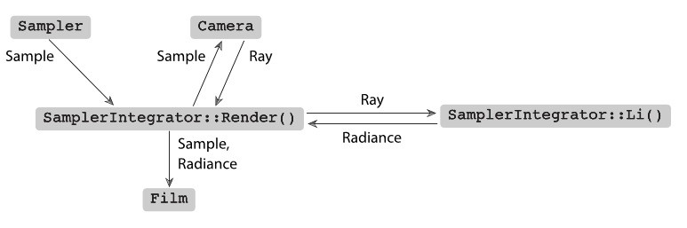
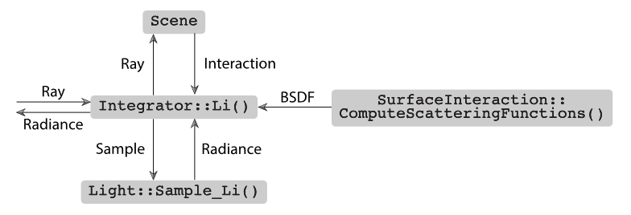
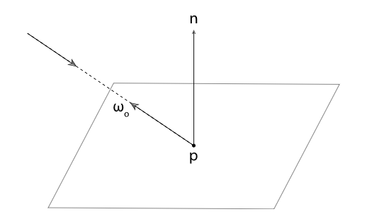

# pbrt 系统概述

## 1. 执行阶段

pbrt 可以被分为两个执行阶段. 首先是通过场景描述文件创建场景. 场景中包括了图元, 图元的材质, 光源, 用于成像的摄像机, 系统中使用的算法所需要的参数等信息. 这个阶段会产生一个 Scene 的实例和一个 Integrator 的实例. Scene 的实例包含着场景的信息, Integrator 的实例负责渲染的实现. 这个阶段结束后会进入执行的第二阶段: 主渲染循环.

---

## 2. 场景表示

Scene 类中包含着光源( *Light* ), 图元( *Primitive* ), 包围盒( *Bounds3f* )等. Light 记录了光源的形状和能量分布等信息. Primitive 又包括形状( *Shape* )和材质( *Material* )等. 场景中的图元会被集中到一个聚合( ***Aggregate*** )中, 由于具体实现, 可以把聚合视为普通的图元. 其存在意义在于其内部具有特定的加速结构, 可以快速的进行相交测试.

---

## 3. 积分器

渲染场景的任务由积分器( *Integrator* )执行. Integrator 是一个抽象类, 每一个 Integrator 的子类都必须实现 Render 方法来进行场景渲染. 这里我们主要介绍 SamplerIntegrator 的 WhittedIntegrator. SamplerIntegrator 的名称源于其渲染过程由来自 Sampler 的样本流驱动的事实; 每个这样的样本定义一个图像上的点, 积分器应该计算到达的光以形成图像.

SamplerIntegrator 中包含采样器( *Sampler* ), 摄像机( *Camera* )等. Sampler 首先负责选择被追踪的光线在平面上的点. 其次他负责提供积分器使用的样本位置用于估计光传输的积分值. 生成这些样本的良好分布是渲染过程的重要内容, 这可以显著的影响整体效率.

Camera 则主要包含镜头的位置, 方向, 焦点, 视野等信息. 值得一提的是其成员中包含一个 Film 示例. Film 用于处理图像的存储.

---

## 4. 主渲染循环

在 Scene 和 Integrator 被创建之后, Integrator::Render() 方法被调用, 开始执行 pbrt 的第二阶段: 主渲染循环. 在 Render 的实现中, 其使用 Camera 和 Sampler 生成一条进入场景的射线, 并使用 Li 方法探测沿着射线到达图像平面的光量, 这个值又被传递给 Film 用于生成图像. 流程图如下所示

pbrt 会将图片分成 16 x 16 的小块( *tile* )并行渲染, 渲染每一块的流程包括:

1. 利用 MemoryArena 为 tile 分配内存.
2. 获取 tile 的 Sampler 实例.
3. 计算 tile 的 sample bounds (由于图像本身的大小或者用户设置, 块的大小可能不是完整的16x16).
4. 获取 tile 的 FilmTile.
5. 循环 tile 中的每一个像素并渲染他们.
6. 将渲染好的 tile 合并到 Film 中.

其中渲染每一个像素又会包含以下步骤:

1. 为当前的 sample 初始化 CameraSample.
2. 为当前的 sample 生成 camera ray.
3. 计算 camera ray 上的辐射度.
4. 将 camera ray 的贡献添加到图像上.
5. 释放正在计算的 sample 的 MemoryArena 的内存

---

## 5. Whitted 光线追踪积分器

在第14章和第15章将会介绍多种积分器的实现, 他们基于不同精度等级的算法. 现在主要介绍一种基于 Whitted 光线追踪算法的积分器, 这种积分器可以精确计算来自镜面的反射和透射光(比如玻璃, 镜子, 水面), 但是对于其他类型的间接光照效果就没有很好的模拟(比如从墙壁反射的光线).

Whitted 积分器通过递归的计算反射和折射光线的辐射度来工作. 他通过预先设置的最大深度(默认为5)来停止递归. 作为 SamplerIntegrator 的一种实现, 他必须提供一个 Li 方法的实现用来计算沿光线方向的辐射度. Li 方法的工作流程如下图所示, 首先主渲染循环将当前的光线输入给 Li 方法, 然后 Li 根据光线确定在场景中最近的交点, 然后计算交点处的材质属性, 这个属性用 BSDF 来表示, 最后根据这个信息结合场景中的灯光来确定此处的辐射度并返回.

对于交点如下图所示, 射线与平面的交点为 p, 交点处的法线为 n, 我们需要计算反射辐射度的方向为 $\omega_o$, 其方向刚好是入射方向的反向(书中使用 $\omega$ 表示 Normalized 之后的方向向量, 代码使用 wo 表示 $\omega_o$).

