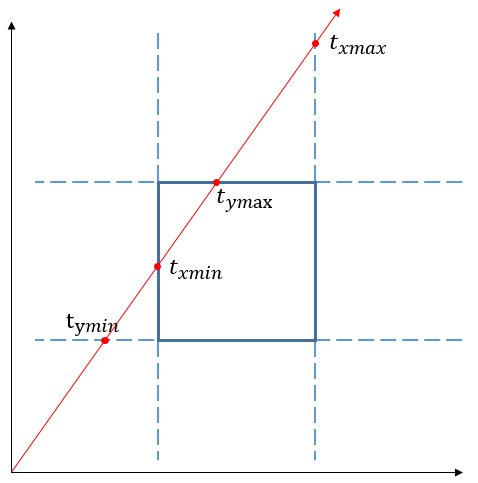

# 包围盒的相交测试

## 1. 重载1

```c++
bool IntersectP(const Ray &ray, Float *hitt0 = nullptr,
                 Float *hitt1 = nullptr) const;
```

包围盒与射线的相交测试本质上就是进行射线与平面的相交测试. 利用包围盒六个面的特殊性: **垂直于某个坐标轴**, 这个相交测试将变得非常简单. 我们可以将其分为 3 组, 每一组都只需要考虑二维层面上的相交情况, 如下图所示:



例如垂直于 x 轴的两个平面, 由于:

$$
ray.o_x + t_{near}*ray.d_x = pMin.x \\
ray.o_x + t_{far}*ray.d_x = pMax.x
$$

所以很容易解出:

$$
t_{near} = (pMin.x - ray.o_x) / ray.d_x \\
t_{far} = (pMax.x - ray.o_x) / ray.d_x
$$

*需要注意的是 $t_{near}$ 不一定比 $t_{far}$ 小, 所以在这里我们还要进行一次判断.*

```c++
if (tNear > tFar) std::swap(tNear, tFar);
```

对另外两组平面进行相同的操作并更新 $t_{near}$ 和 $t_{far}$. 更新操作我们需要寻找的是更大的 $t_{near}$ 和更小的 $t_{far}$, 进而不断逼近和包围盒的真正交点. 但是更新之后当我们发现 $t_{near} > t_{far}$ 的时候, 说明射线和包围盒不相交, 就可以退出了.

如果最后测试没有提前结束则说明射线与包围盒是相交的, 同时函数会更新传入 hitt0 和 hitt1.

---

## 2. 重载2

```c++
inline bool IntersectP(const Ray &ray, const Vector3f &invDir,
                        const int dirIsNeg[3]) const;
```

这个重载可以视为重载1的一个优化. invDir 保存了射线方向三个分量的倒数, dirIsNeg 则代表了包围盒中平行的两个平面哪一个更靠近射线射来的方向.

通过这两个预计算可以削减重载1中的大量比较, 得益于 dirIsNeg 传递的信息, 我们可以直接计算出准确的 $t_{near}$ 和 $t_{far}$, 而不再需要判断大小并交换. 并且 invDir 的计算也被放在了相交测试的外面进行.

这项优化的意义体现加速结构 BVH 的遍历中, 其遍历过程针对某一条射线, 需要与大量的包围盒进行相交测试. 这时重载1在其内部计算 invDir 的操作会产生大量冗余, 经过 pbrt 作者测试, 重载2在渲染时会将性能提升接近 15%.

*注意这个重载在射线完全位于包围盒内部时也会返回 true.*