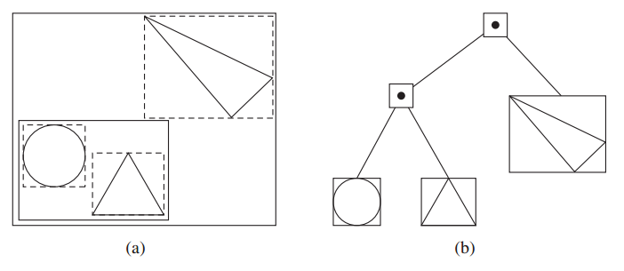
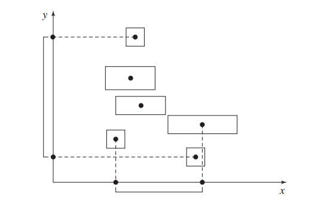
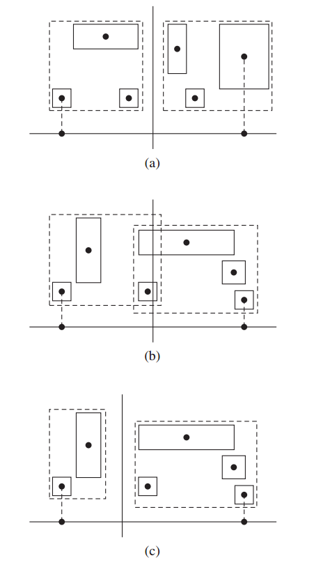
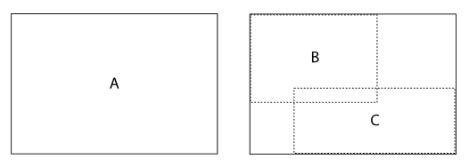
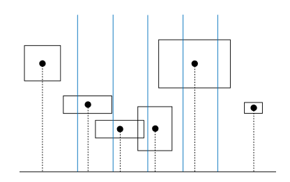
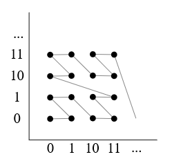
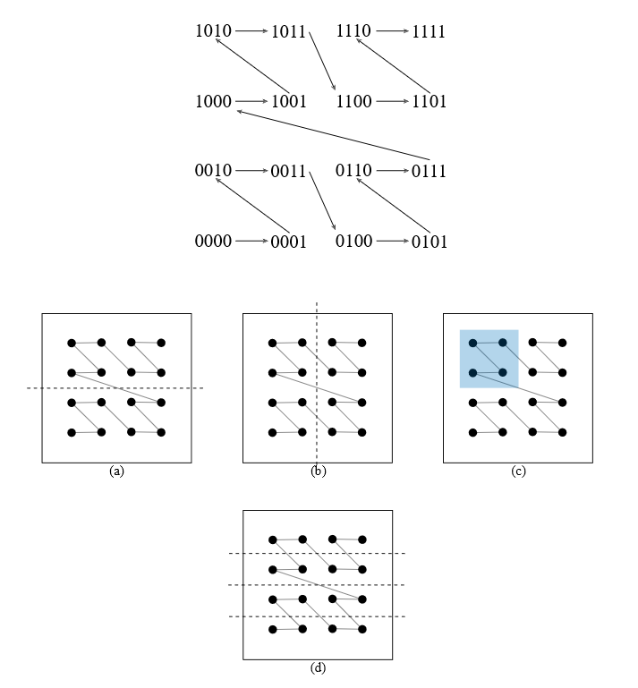
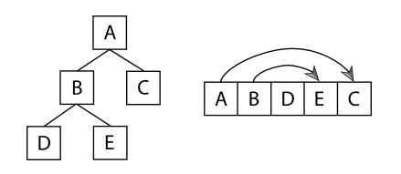
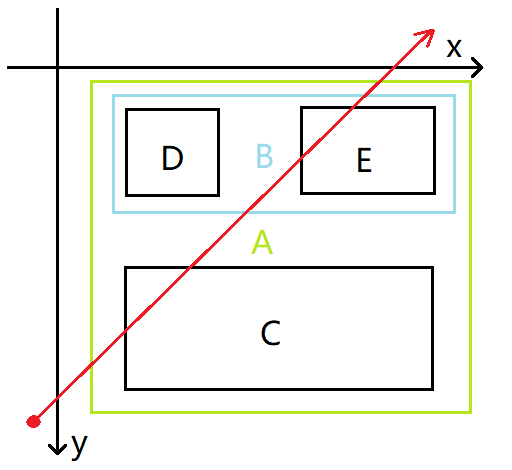

# Bounding volume hierarchies

## 1.1 概述

包围体层次结构根据图元细分实现了一种光线相交加速方案. 如下图所示:

图元集合的包围盒由虚线表示, 图元的分组方式根据邻近程度予以实现. 圆和正三角形由一个包围盒包围, 整个场景又由一个大包围盒包围起来(这两个包围盒用实线表示). 最终就会构造出(b)所示的二叉树.



表示 BVH 所需要的内存通常是有限并且可计算的. 对于各个叶子节点存储单一图元的 BVH 二叉树而言, 全部节点数量最多为 $2n-1$, 其中 $n$ 表示图元数量, 叶子节点和内部节点数量分别为 $n$ 和 $n-1$.

与 BVH 相比, 后面要介绍的 kd 树通常可以实现快速的相交计算, 但是其构造过程要更长一些. 另外与 kd 树相比, BVH 具有更好的数值健壮性以及针对舍入误差问题的抗干扰性.

---

## 1.2 构建 BVH

### 1.2.1 基础构建

构建 BVH 分为三个阶段. 首先计算所有图元的包围信息存储在数组中. 然后将根据 *splitMethod* 指定的算法来构建 BVH 二叉树. 最后将这个树形结构转换为更紧凑的无指针表达方式, 以供渲染操作使用.

我们定义一个结构体 *BVHPrimitiveInfo* 来存储 BVH. 每个 BVHPrimitiveInfo 实例都保存着图元的中心, 包围盒以及其在 BVHPrimitiveInfo 数组中的下标.

```c++
// BVHPrimitiveInfo 结构体
struct BVHPrimitiveInfo {
    BVHPrimitiveInfo(size_t primitiveNumber, const Bounds3f &bounds)
    : primitiveNumber(primitiveNumber), bounds(bounds),
    centroid(.5f * bounds.pMin + .5f * bounds.pMax) { }

    size_t primitiveNumber;
    Bounds3f bounds;
    Point3f centroid;
};

// 初始化 primitiveInfo 数组
std::vector<BVHPrimitiveInfo> primitiveInfo(primitives.size());
for (size_t i = 0; i < primitives.size(); ++i)
    primitiveInfo[i] = { i, primitives[i]->WorldBound() };
```

接下来就可以开始递归构造过程了. 其中当划分方法是 SplitMethod::HLBVH 的时候会调用另一个特殊构建函数(HLBVHBuild), 其他方法都是调用 recursiveBuild 构建 BVH 树. 接下来我们也是先讨论 recursiveBuild 方法.

其中 MemoryArena 用来管理内存, totalNodes 指明了树节点的数量, root 为树的根节点, orderedPrims 是树构造之后返回的新的图元数组. orderedPrims 中的图元是排序的, 叶子节点中的图元占据了数组中连续的范围. 最后原始图元数组会被 orderedPrims 代替.

```c++
enum class SplitMethod { SAH, HLBVH, Middle, EqualCounts };
```

```c++
// 使用 primitiveInfo 为图元构造 BVH 树
MemoryArena arena(1024 * 1024);
int totalNodes = 0;
std::vector<std::shared_ptr<Primitive>> orderedPrims;
BVHBuildNode *root;
if (splitMethod == SplitMethod::HLBVH)
    root = HLBVHBuild(arena, primitiveInfo, &totalNodes, orderedPrims);
else
    root = recursiveBuild(arena, primitiveInfo, 0, primitives.size(), &totalNodes, orderedPrims);

primitives.swap(orderedPrims);
```

BVHBuildNode 表示 BVH 树的一个节点, 每个节点都保存了一个包围盒, 这个包围盒表示了该节点下所有节点的边界. 每个节点还会保存两个指向其自身子节点的指针. 内部节点还会保存其子节点被划分时选择的轴向, 这个信息可以提高遍历的表现. 叶节点中需要记录哪些图元存储在其中, 这些图元利用一个偏移量和一个数量来表示, 所以原始图元数组是需要重新排序的. 另外我们通过一个节点的 children 是否为空来区分内部节点和叶节点.

```c++
struct BVHBuildNode {
    // 初始化叶节点
    void InitLeaf(int first, int n, const Bounds3f &b) {
        firstPrimOffset = first;
        nPrimitives = n;
        bounds = b;
        children[0] = children[1] = nullptr;
    }

    // 初始化内部节点
    void InitInterior(int axis, BVHBuildNode *c0, BVHBuildNode *c1) {
        children[0] = c0;
        children[1] = c1;
        bounds = Union(c0->bounds, c1->bounds);
        splitAxis = axis;
        nPrimitives = 0;
    }

    Bounds3f bounds;
    BVHBuildNode *children[2];
    int splitAxis, firstPrimOffset, nPrimitives;
};
```

recursiveBuild 还接受两个参数 start 和 end. 这两个参数表示了需要构造 BVH 的 primitiveInfo 子集. 其中从 primitiveInfo[start] 到 primitiveInfo[end - 1] 会被用来构造 BVH (也就是说 end - start 实际上表示子集中 BVHPrimitiveInfo 对象的数量). 当这个范围内只有一个图元的时候递归操作将至最低点并产生一个叶子节点. 否则, 将根据某一种算法将这个子集再次分为两个子集, 并重新排序. [start, mid) 和 [mid, end) 两个子集将进入递归, 他们的返回结果就是当前节点的两个子节点.

totalNodes 记录所有节点的数量, 利用他可以为后面的 LinearBVHNodes 提供更为准确的内存空间. 在叶节点存储图元的时候, 我们需要同时处理 orderedPrims. 只有这样我们才可以在叶节点中利用 firstPrimOffset 和 nPrimitives 来表示叶子中存储的图元.

综上我们可以给出 recursiveBuild 的实现如下.

```c++
BVHBuildNode *BVHAccel::recursiveBuild(MemoryArena &arena,
        std::vector<BVHPrimitiveInfo> &primitiveInfo, int start,
        int end, int *totalNodes,
        std::vector<std::shared_ptr<Primitive>> &orderedPrims) {
    BVHBuildNode *node = arena.Alloc<BVHBuildNode>();
    (*totalNodes)++;
    // <> 是文学编程(Literate Program)使用的符号, 约等于注释, 用一句话来描述功能, 代替大段的实现代码.
    <计算[start, end)中所有图元的包围盒>
    int nPrimitives = end - start;
    if (nPrimitives == 1) {
        <创建叶节点>
    } else {
        <计算图元包围盒中心并确定划分的轴向>
        <将图元分为两部分并创建子节点>
    }
    return node;
}
```

```c++
<计算[start, end)中所有图元的包围盒>≡
    Bounds3f bounds;
    for (int i = start; i < end; ++i)
        bounds = Union(bounds, primitiveInfo[i].bounds);
```

```c++
<创建叶节点>≡
    int firstPrimOffset = orderedPrims.size();
    for (int i = start; i < end; ++i) {
        int primNum = primitiveInfo[i].primitiveNumber;
        orderedPrims.push_back(primitives[primNum]);
    }
    node->InitLeaf(firstPrimOffset, nPrimitives, bounds);
    return node;
```

对于内部节点, 我们首先需要将图元进行划分, 进而构造两颗子树. 在构造 BVH 时通常会沿某一个轴向进行划分. 对于有当前图元集合, 可以选择具有最大包围盒质心范围的轴向. 对于下图的二维环境中, 沿 y 轴具有最大范围, 因此图元将沿着 y 轴进行划分.

我们划分过程的主要目标是两个子集的包围盒交叉尽可能的小, 否则在遍历的时候可能会需要频繁的遍历两个子树. 稍后我们会将这个图元划分理念以更为严格的方式予以确定(启发式表面积, surface area heuristic)



```c++
<计算图元包围盒中心并确定划分的轴向>≡
    Bounds3f centroidBounds;
    for (int i = start; i < end; ++i)
        centroidBounds = Union(centroidBounds, primitiveInfo[i].centroid);

    int dim = centroidBounds.MaximumExtent();
```

如果所有的图元中心都在相同的位置, 则递归停止. 在这种特殊情况下, 我们并没有很好的方法去进行图元的划分. 这些图元将会被保存到一个叶节点中. 而通常情况下, 我们会根据特定的划分方法将图元划分为两个子集并进行两次递归.

```c++
<将图元分为两部分并创建子节点>≡
    int mid = (start + end) / 2;
    if (centroidBounds.pMax[dim] == centroidBounds.pMin[dim]) {
        <创建叶节点>
    } else {
        <基于 splitMethod 划分图元>
        node->InitInterior(dim,
            recursiveBuild(arena, primitiveInfo, start, mid, totalNodes, orderedPrims),
            recursiveBuild(arena, primitiveInfo, mid, end, totalNodes, orderedPrims));
    }
```

<基于 splitMethod 划分图元> 的代码片段这里不再展示, 根据不同的 splitMethod 后面会具体讨论相应的划分策略.

一种简单的策略就是 SplitMethod::Middle. 他会计算当前所有图元整体的包围盒在划分轴向上的中点, 然后将中点一侧的图元划分为一个子集, 另一侧的图元划分为另一个子集. 如果图元的包围盒交叉非常严重, 那么这种划分方式可能会失败( mid == start || mid == end ??? 怎么会出现这种情况 ???). 这时算法会退化为 SplitMethod::EqualCounts, 这个划分策略更为简单, 将图元中心在划分轴向上较小的一半分为一个子集, 较大的一半分为另一个子集.

对于下图(a)中的情况 SplitMethod::Middle 工作良好. 而对于(b)的情况, 这时 SplitMethod::Middle 只能算作次优解, 明显以(c)的方式进行划分, 两颗子树不存在交叉, 而且包围盒也更小. 同样的 SplitMethod::EqualCounts 也不能更好的工作.



SplitMethod::Middle 和 SplitMethod::EqualCounts 在 pbrt 中都使用 c++ 标准库函数予以实现.
SplitMethod::Middle 使用 std::partition. 而 SplitMethod::EqualCounts 使用 std::nth_element.

```c++
<SplitMethod::Middle 划分>≡
    Float pmid = (centroidBounds.pMin[dim] + centroidBounds.pMax[dim]) / 2;
    BVHPrimitiveInfo *midPtr =
    std::partition(
        &primitiveInfo[start],
        &primitiveInfo[end-1]+1,
        [dim, pmid](const BVHPrimitiveInfo &pi) {
            return pi.centroid[dim] < pmid;
    });

    // 将返回的中间图元指针换算为偏移.
    mid = midPtr - &primitiveInfo[0];

    // 划分策略在整个构建函数中处于一个 switch 语句的不同 case 中,
    // 策略失败时跳过 break 则会进入到下一级策略中, 也就是 SplitMethod::EqualCounts
    // 但是为什么会出现失败的情况 ????
    if (mid != start && mid != end)
        break;
```

```c++
<SplitMethod::EqualCounts 划分>≡
    mid = (start + end) / 2;
    std::nth_element(
        &primitiveInfo[start],
        &primitiveInfo[mid],
        &primitiveInfo[end-1]+1,
        [dim](const BVHPrimitiveInfo &a, const BVHPrimitiveInfo &b) {
            return a.centroid[dim] < b.centroid[dim];
    });
```

---

### 1.2.2 启发式表面积算法(Surface Area Heuristic)

针对上述两种方法的局限性, 我们在构建相交测试的加速结构时, 一般会采用基于 Surface Area Heuristic 的方法.

SAH 模型估计执行光线相交测试所需要的开销, 然后算法遵循最小化成本的目标来构建加速结构. 我们通常使用贪婪算法来最小化构建层次结构的每个单独节点的成本. 这是一种利用统计规律来估计开销并依此进行图元划分的算法.

我们假设一条光线与任何图元进行相交测试的时候消耗的时间都相等. 现在集合 S 中有 n 个图元, 如果我们不做任何处理, 那么相交测试所消耗的总时间是 $Cost(S) = t(1) + t(2) + ... + t(n)$

这时如果我们把这 n 个图元分成 A, B 两个子集, 那么相交测试消耗的时间是 $Cost(S) = t_{trav} + P_ACost(A) + P_BCost(B)$, 其中 $t_{trav}$ 是决定进入哪一个子集消耗的时间, $P_A$, $P_B$ 分别是进入两个子集的概率. 我们可以根据几何概型和条件概率来进行相应的计算. 对于下图来说, 均匀分布的光束通过 A 的同时也通过 B 的概率是 $P(B|A) = s_B/s_A$, 其中 $s_A$, $s_B$ 是区域的面积.



相较于计算所有的划分方式的消耗, 我们采用将所有图元按照划分轴向分散到若干个"桶"中, 把每个桶看做一个整体, 然后依次计算按照下图每条蓝线分割时的消耗, 最后取最小值作为划分依据 (PBRT的实现中将图元划分成12个桶).



---

### 1.2.3 LBVH (Linear Bounding Volume Hierarchies)

利用 SAH 构建的 BVH 树可以提供良好的结果, 但是这个方法同样存在一些缺陷. 首先在构建每一级的过程中需要计算非常多次 SAH 的成本. 另外这种方法也难以进行并行化. 为了能够并行的处理这个问题, LBVH 的方法被提了出来. 这种方法构建 BVH 树消耗的时间与图元的数量呈线性关系. 然后这种算法会在一开始将图元划分成若干独立的集合(cluster), 这样可以更容易实现并行化.

LBVH 的关键思想是将 BVH 构建转换成一个排序问题. 但是因为没有针对多维数据的排序算法, 所以我们利用莫顿编码(*Morton codes*)来将三维的位置信息转换到一维. 这样经过排序之后, 在空间上接近的图元集合就会在数组的连续分段上.

莫顿编码: 以二维数据 $(x, y)$ 为例, 我们设 $x$, $y$ 转换为二进制时每一位的数据是 $x_i$ 和 $y_i$. 那么莫顿编码就是 $y_ix_i...y_3x_3y_2x_2y_1x_1y_0x_0$. 经过这样的编码之后, 如果把二维上的每个点按照编码大小的顺序连接起来, 就会发现我们得到了一条如下图所示 "Z型" 的曲线. 这条曲线也可以叫做莫顿曲线. 很明显, 大多数在空间相临近的点在这样的排序数组中也处在比较接近的位置.



*许多 GPU 在存储纹理数据的时候也会选择使用莫顿布局. 这样的存储方法与扫描线的方式相比, 临近的像素在内存中的位置也会比较相近, 在进行诸如双线性插值(bilinear)这种需要计算附近4个像素的颜色值的操作时会有更高的效率.*

经过莫顿编码, 我们会得到一些很有趣的性质. 比如下图中4位的莫顿编码 $y_1x_1y_0x_0$:

1. 最高位 $y_1$ 将所有点分为上下两部分(a)
2. 次高位 $x_1$ 将所有点分为左右两部分(b)
3. 如果 $y_1 = 1$ 并且 $x_1 = 0$, 那么这些点一定位于(c)所示的阴影区域中
4. 下一级的 y bit($y_0$) 将所有点分为 y 方向上的四部分(d)



LBVH 是通过使用位于每个空间区域中点处的分割平面来分割图元进而构建 BVH 树的方法. 因为他基于上述的莫顿编码属性, 所以分区非常有效.

---

## 1.3 遍历过程中的紧凑型 BVH

为了提高性能, 我们最后还需要将树结构转换为一种更加紧凑的表达形式. 对已经构建完成的 BVH 树, 我们对其进行深度优先遍历, 然后将遍历到的节点依次存储在一个数组中即可.

根据深度优先遍历, 如下图所示, 我们可以看出对于一个内部节点(图中 A, B), 其第一个子节点在数组中一定紧随其后, 而第二个子节点的位置需要我们通过一个偏移量来获取. 幸运的是这个偏移量在我们进行树的遍历的过程中会非常容易且自然的计算出来.



---

## 1.4 遍历

我们将树转化成为数组之后遍历的过程就和想象中一样, 利用偏移来确定接下来要和那颗子树进行相交测试. 这里具体的实现细节没有特殊的地方, 下面着重说一下之前提到的记录分割轴向的意义.

1.3节展示的树, 我们假设图元在二维平面的分布状况如下图所示, 那么根节点A记录的划分轴向是 **y**. 对于图中的红色射线, 遍历的过程中我们首先判断出射线与 A 相交, 那么接下来需要依次再和 A 的两颗子树进行相交测试. 但是我们先测试左子树还是右子树呢? 这时记录在节点 A 中的分割轴向就起到了作用. 我们知道节点 A 在 y 轴方向上被分割为两部分, 而射线指向 y 轴的负方向, 那么如图所示的一般情况下, 射线会先与右子树相交, 所以我们也先测试射线与 A 的右子树的相交性.

这样做的意义在于如果射线与 A 的右子树相交, 那么这时射线会更新自身的 *tMax*. 这样在之后与其左子树进行相交测试的时候就可以快速的退出相交测试, 避免无用的计算(因为如果相交的话我们还需要计算很多相交处的表面信息).

