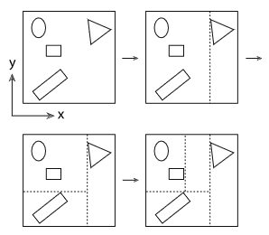

# Kd-Tree

## 1. 概述

BSP树(Binary space partitioning)是用平面不断的分割空间得到的. 他的构建从包含整个场景的包围盒开始, 如果包围盒中的图元超过一定限制就将这个包围盒分割成两办, 图元与哪一半重叠就会与那一半关联(这与 BVH 树不同, BVH 中一个图元只会属于一颗子树). 由于这种算法在分割空间时在不同的区域可以使用不同的分割维度, 使得 BSP 树可以更容易的处理图元在场景中分布不均匀的情况.

两种常见的 BSP 树变形就是 Kd-Tree 和八叉树. Kd-Tree 严格要求分割平面与某条坐标轴垂直, 这使得树的构建和遍历都比较容易, 代价是牺牲了部分空间分割上的灵活性. 八叉树则使用三个与三条坐标轴垂直的平面每次将空间分割成八个小块.

下图展示了建立一颗 Kd-Tree 的流程, 其中在哪个轴向上分割空间, 分割空间的平面放在什么位置上, 什么时候停止细分等在实践中都会显著的影响树的性能.

---

## 2. 树的表示

待更新.