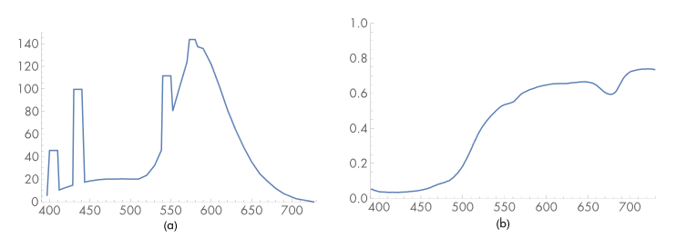

# Spectral Representation

## 1. 概述

现实世界中物体的光谱强度分布( SPD, Spectral power distributions )一般都比较复杂. 如图分别是荧光灯发射的光的 SPD 和柠檬皮反射光的 SPD. 渲染器需要简洁, 高效, 准确的表达这种曲线, 在实践中一般需要在各方面做出平衡.

我们可以基于寻找一个优秀的基础函数表示 SPD 来构建一个框架, 隐藏在这之后的思想是将无穷维的 SPD 函数映射到一个低维的函数上. 本章介绍两种光谱的表示: RGBSpectrum 和 SampledSpectrum.

---

## 2. CoefficientSpectrum 实现

本章要介绍的两种 Spectrum 均存储固定数量的 SPD 采样, 所以可以一开始定义一个模板类 CoefficientSpectrum, 根据模板参数 nSpectrumSamples 给定的采样数来表示光谱. RGBSpectrum 和 SampledSpectrum 都继承自 CoefficientSpectrum. CoefficientSpectrum 需要提供各种算数运算包括加减乘除, 开平方, Pow, Exp 等方法, 这里不做实现展示. 另外一些诸如 IsBlack, Lerp, Clamp, HasNaNs 等方法也很有用, 但是同样不在这里赘述实现.