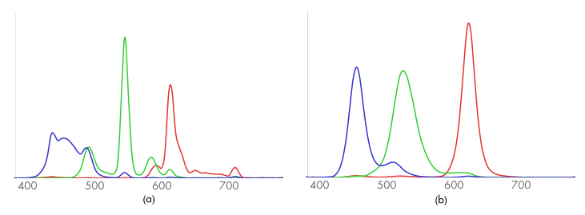
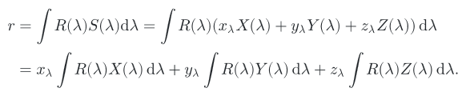
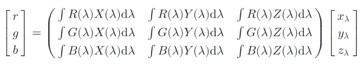

# SampledSpectrum 类

## 1. 概述

SampledSpectrum 使用了 CoefficientSpectrum 类的基本结构来表示光谱, 在波长范围的起点和终点之间均匀的插入若干个采样点. 一般我们选择的波长范围是 400nm 到 700nm, 这是人眼最敏感的波长范围. 而 60 个采样点一般足以准确的表达一个比较复杂的 SPD. 所以首个采样点表示 [400, 405) 的波长, 第二个采样点表示 [405, 410) 的波长, 以此类推.

光谱的数据来源一般被组织成一个 $(\lambda_i, v_i)$ 的数组, 而这个数组中波长并不一定是均匀的. 换句话说光谱数据的采样点并不像我们定义的那样每 5nm 进行一次采样. 所以我们需要对输入数据进行处理, 其原理如下图所示, 本质上就是求图中阴影部分的面积( AverageSpectrumSamples 方法的目的 ). 整个过程相当于一个采样和重构的一维实例( 这将在第七章讨论 ).


---

## 2. XYZ 颜色

人类视觉系统的一个显著特征使得 3 个浮点数就可以为人类的感知系统准确表达颜色. 色彩表达的 3 色视觉理论表明, 通过 $x_\lambda, y_\lambda, z_\lambda$ 三个值就可以准确表达观察者所见到的颜色. 根据输入 SPD 值 $S(\lambda)$, 其对应值的计算如下:


其中 $X(\lambda), Y(\lambda), Z(\lambda)$ 的曲线如下图所示, 这些曲线是由国际照明协会( *CIE* ) 经过一系列测试后确定的. 这一类曲线类似于视网膜上三种视锥细胞的反馈模式.


pbrt 提供了标准的 $X(\lambda), Y(\lambda), Z(\lambda)$ 相应曲线值并存储在 CIE_X, CIE_Y, CIE_Z, CIE_lambda 四个数组中, 覆盖了 360nm 到 830nm 的波长. 这种方式也可以方便的使用之前提到的 AverageSpectrumSamples 方法进行计算.

SampledSpectrum 含有三个静态成员 X, Y, Z 用于保存这三条曲线. 他们使用 init 函数, 利用和处理原始光谱数据类似的方法初始化, 而 init 函数会在系统初始化的时候被 pbrtInit 调用.

所有的 Spectrum 都需要实现一个方法 **ToXYZ** 将他们的 SPD 转化为 $(x_\lambda, y_\lambda, z_\lambda)$ 系数, 这里根据上面提到的计算公式利用"黎曼和"( *Riemann sum* )来计算积分结果.


XYZ 颜色中的 y 值和亮度关系紧密, 并用于测算所感知到的色彩亮度( 5.4.3 会对亮度详细讨论 ). 这个值在一些场景比较常用, 对此我们额外提供一个方法 y() 来获取 XYZ 颜色的 y 值.

---

## 3. RGB 颜色

当我们在显示器上显示 RGB 颜色的时候, 实际显示的光谱由三条光谱响应曲线的加权和定义, 这三条响应曲线与显示器本身的性质有关, 分别代表红绿蓝三色. 下图(a)显示了 LCD 显示器的光谱响应曲线, 图(b)显示了 LED 显示器的光谱响应曲线.



实际上我们需要做的是 XYZ 颜色与 RGB 颜色之间的相互转换. 把三条光谱响应曲线定义为 $R(\lambda), G(\lambda), B(\lambda)$, 那么对于输入的 XYZ 颜色 $(x_\lambda, y_\lambda, z_\lambda)$ 来说, RGB 颜色中的 r 的计算如下所示.



同理我们可以得到 g, b 的计算公式, 经过整理我们可以得到如下的转换公式:



由于有无穷多组不同的 SPD 会具有相同的 XYZ 或 RGB 系数, 当输入一个 XYZ 或 RGB 系数之后, 存在无穷多个 SPD 可供选择, 转换函数也将包含多种方案. 但是这些方案应该满足一下特征

- 如果所有的 RGB 系数具有相同的值, 那么 SPD 也应该是恒定的
- 一般而言, 所计算的 SPD 光谱应该呈现连续的平滑状态. 在真实世界中, 大多数对象具有相对连续的光谱.

其中第二点特征说明了为什么采用显示设备的光谱响应曲线加权和来表示 SPD 不是一个好的方法. 就像之前的曲线图显示的, 其对应函数通常较为突兀且不连续, 其加权和也难以获得平滑的 SPD. 尽管最后的结果表示为既定颜色的条件等色, 但是这并不是准确的 SPD 表达结果. pbrt 中实现了 Smits (1999) 推荐的 RGB-SPD 准换方法, 其针对反射光谱和光源光谱提供了下面代码片段中的数据, 我们可以利用 AverageSpectrumSamples() 对其进行重采样, 并利用得到的的值实现 RGB-SPD 转化.

``` c++
static const int nRGB2SpectSamples = 32;
extern const Float RGB2SpectLambda[nRGB2SpectSamples];
extern const Float RGBRefl2SpectWhite[nRGB2SpectSamples];
extern const Float RGBRefl2SpectCyan[nRGB2SpectSamples];
extern const Float RGBRefl2SpectMagenta[nRGB2SpectSamples];
extern const Float RGBRefl2SpectYellow[nRGB2SpectSamples];
extern const Float RGBRefl2SpectRed[nRGB2SpectSamples];
extern const Float RGBRefl2SpectGreen[nRGB2SpectSamples];
extern const Float RGBRefl2SpectBlue[nRGB2SpectSamples];

extern const Float RGBIllum2SpectWhite[nRGB2SpectSamples];
extern const Float RGBIllum2SpectCyan[nRGB2SpectSamples];
extern const Float RGBIllum2SpectMagenta[nRGB2SpectSamples];
extern const Float RGBIllum2SpectYellow[nRGB2SpectSamples];
extern const Float RGBIllum2SpectRed[nRGB2SpectSamples];
extern const Float RGBIllum2SpectGreen[nRGB2SpectSamples];
extern const Float RGBIllum2SpectBlue[nRGB2SpectSamples];
```

RGB-SPD 转化的实现比较简单, 以反射光为例, 我们假设 (r, g, b) 中 r 的值是最小的, 那么我们可以先将 r 的值与白色光谱 rgbRefl2SpectWhite 相乘; 这样之后下一步需要处理的 RGB 颜色就变为 (0, g-r, b-r), 然后再在 g-r 和 b-r 中找更小的一个去和青色光谱(绿+蓝) rgbRefl2SpectCyan 相乘并累加到结果中; 最后我们将处理的是 (0, g-b, 0) 或者 (0, 0, b-g), 将其与绿色光谱 rgbRefl2SpectGreen 或蓝色光谱 rgbRefl2SpectBlue 相乘后累加到结果中将得到最后经 RGB 参数转化得到的 SPD.

有了 RGB-SPD 转化的转化之后 XYZ-SPD 的转化就简单了, 我们可以将 XYZ 先转化为 RGB, 然后就可以使用相同的方法得到 SPD.