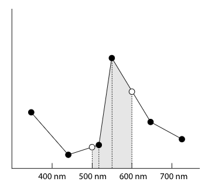
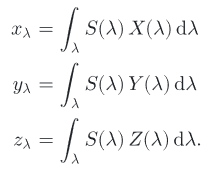
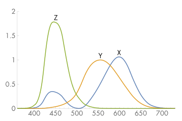
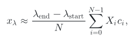

# SampledSpectrum 类

## 1. 概述

SampledSpectrum 使用了 CoefficientSpectrum 类的基本结构来表示光谱, 在波长范围的起点和终点之间均匀的插入若干个采样点. 一般我们选择的波长范围是 400nm 到 700nm, 这是人眼最敏感的波长范围. 而 60 个采样点一般足以准确的表达一个比较复杂的 SPD. 所以首个采样点表示 [400, 405) 的波长, 第二个采样点表示 [405, 410) 的波长, 以此类推.

光谱的数据来源一般被组织成一个 $(\lambda_i, v_i)$ 的数组, 而这个数组中波长并不一定是均匀的. 换句话说光谱数据的采样点并不像我们定义的那样每 5nm 进行一次采样. 所以我们需要对输入数据进行处理, 其原理如下图所示, 本质上就是求图中阴影部分的面积( AverageSpectrumSamples 方法的目的 ). 整个过程相当于一个采样和重构的一维实例( 这将在第七章讨论 ).

---

## 2. XYZ 颜色

人类视觉系统的一个显著特征使得 3 个浮点数就可以为人类的感知系统准确表达颜色. 色彩表达的 3 色视觉理论表明, 通过 $x_\lambda, y_\lambda, z_\lambda$ 三个值就可以准确表达观察者所见到的颜色. 根据输入 SPD 值 $S(\lambda)$, 其对应值的计算如下:

其中 $X(\lambda), Y(\lambda), Z(\lambda)$ 的曲线如下图所示, 这些曲线是由国际照明协会( *CIE* ) 经过一系列测试后确定的. 这一类曲线类似于视网膜上三种视锥细胞的反馈模式.

pbrt 提供了标准的 $X(\lambda), Y(\lambda), Z(\lambda)$ 相应曲线值并存储在 CIE_X, CIE_Y, CIE_Z, CIE_lambda 四个数组中, 覆盖了 360nm 到 830nm 的波长. 这种方式也可以方便的使用之前提到的 AverageSpectrumSamples 方法进行计算.

SampledSpectrum 含有三个静态成员 X, Y, Z 用于保存这三条曲线. 他们使用 init 函数, 利用和处理原始光谱数据类似的方法初始化, 而 init 函数会在系统初始化的时候被 pbrtInit 调用.

所有的 Spectrum 都需要实现一个方法 **ToXYZ** 将他们的 SPD 转化为 $(x_\lambda, y_\lambda, z_\lambda)$ 系数, 这里根据上面提到的计算公式利用"黎曼和"( *Riemann sum* )来计算积分结果.

XYZ 颜色中的 y 值和亮度关系紧密, 并用于测算所感知到的色彩亮度( 5.4.3 会对亮度详细讨论 ). 这个值在一些场景比较常用, 对此我们额外提供一个方法 y() 来获取 XYZ 颜色的 y 值.

## 3. RGB 颜色

待更新...