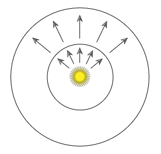
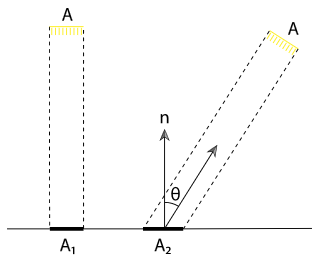
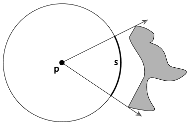
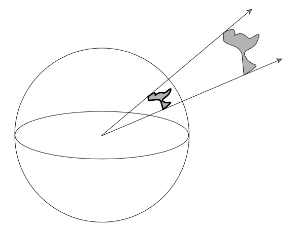
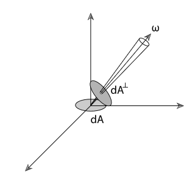
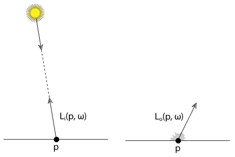

# 辐射度测量

## 1. 概述

辐射测量提供了一套用于描述光线传播和反射的思想以及数学工具, 他构成了渲染算法的基础. 但需要注意的是他最初并不是用来研究光学的, 而是在空间粒子的基础上进行适当抽象. 所以诸如光的偏振等效果并不适用这个框架. 不过与麦克斯韦方程组建立的连接为辐射度测量提供了坚实的物理学基础.

辐射传输是研究辐射能的一门学科, 他基于辐射原理并在几何光学水平上进行操作. 因为光的宏观特性足以描述光是如何与远大于波长的物体进行相互作用的, 所以很少根据波光学模型整合光学现象, 此类结果需要通过辐射传输的基础抽象语言加以表达. 通过这种方式我们可以描述光与具有与光的波长大致相同尺寸的物体的相互作用, 对光的色散和干涉等现象进行建模.

在更进一步的微观尺度上我们需要量子力学进行研究, 但是幸运的是在图形渲染领域, 我们不需要考虑这种问题.

在 pbrt 系统中, 我们假设几何光学是一个合适的模型, 可以用来描述光以及光的散射. 这将会引出一些关于光的行为的假设并隐含与整个系统中.

- 线性关系( *Linearity* ): 多个光源的共同作用等价于各自独立作用之和.
- 能量守恒( *Energy conservation* ): 当光线发生散射时不会产生额外的能量.
- 忽略偏振( *No polarization* ): 基于波长的分布状态将成为光的唯一相关特性.
- 忽略荧光或磷光现象( *No fluorescence or phosphorescence* ): 与偏振类似, 实用价值较低.
- 稳定的状态( *Steady state* ): 假设环境中的光已达到平衡, 因此其辐射分布不随时间变化. 这在现实场景中几乎瞬间发生, 因此在实践中不是限制. 注意, 之前提到的磷光便违反了稳态假设。

当采用几何光学模型的时候, 最重大的损失就是衍射和干涉现象通常难以处理. 在展示这些现象的时候, 两个区域的总通量并不等于各自通量的和( Preisendorfer, 1965, 24页 ).

---

## 2. 基础物理量

渲染关注辐射度测量的四个基本量: 通量( flux ), 入射辐射度/出射辐射度( irradiance / radiant exitance ), 强度( intensity ), 辐射度( radiance ). 这些量可以通过对时间, 面积, 方向等属性进行限制, 进而通过能量得出( 以焦耳为单位 ). 他们通常取决于波长, 接下来我们不会明确的表达这种依赖, 但需要谨记这很重要.

### 2.1 能量

我们以焦耳为单位统计能量. 光源会向外发射光子, 每一个光子都处于特定的波长并携带一份特定量的能量. 所有基本辐射量都是测量光子的有效方式. 其中一个波长为 $\lambda$ 的光子所携带的能量如下

$$
Q = \frac{hc}{\lambda} \\
光速 c \approx 299,472,458 m/s, 普朗克常量 h \approx 6.626 * 10^{-34} m^2kg/s
$$

### 2.2 通量 Flux

通量也被称为功率, 他表示在单位时间内通过一个表面或空间中某个区域的总能量. 辐射通量可以利用下式计算:

$$
\Phi = \lim_{\Delta t \to 0}\frac{\Delta Q}{\Delta t}=\frac{dQ}{dt}
$$

通量的单位是焦耳每秒( J/s ), 或者更常用的瓦特( W ).

相反, 我们也可以根据时间的积分来求出一段时间内的总能量:

$$
Q=\int_{t1}^{t2}\Phi(t)dt
$$

需要留意的是在其他问题上, 因为光子实际上是离散的量子, 对时间微分是没有意义的. 但是对于渲染而言, 相对于我们关注的测量范围内光子的数量足够巨大, 在实践中这个细节不会产生问题. (*Note that our notation here is slightly informal: among other issues, because photons are actually discrete quanta, it’s not really meaningful to take limits that go to zero for differential time. For the purposes of rendering, where the number of photons is enormous with respect to the measurements we’re interested in, this detail isn’t problematic in practice.*)

我们通常用通量来描述一个光源发射的总能量, 下图展示了通量的含义. 值得注意的是虽然在较大的球上每一个小区域所通过的能量都要比小球上相应的区域少, 但是因为面积的补偿, 通过两个球面的总能量实际上的相等的.

### 2.3 入射辐射度/出射辐射度 Irradiance and Radiant Exitance

给定一个有限的面 *A*, 我们可以将 $E=\Phi / A$ 定义为这个面的平均功率密度. 这个值是 Irradiance( *E*, 到达表面的通量面密度 ), 也是 Radiant Exitance ( *M*, 离开表面的通量面密度 ). 其单位是瓦特每平方米( $W/m^2$ ).

比如 2.2 提到的点光源, 在外圈的入射辐射度就要比内圈的入射辐射度小. 假设这个点光源在各个方向上的亮度的是相等的, 那么其入射辐射度 *E* 如下:

$$
E=\frac{\Phi}{4{\pi}r^2}
$$

这个式子也解释了为什么点光源会以距离平方的速度衰减.

我们也可以根据极限来定义某一点 *P* 上微分面元的入射辐射度, 从而获得更一般的形式:

$$
E(p)=\lim_{\Delta A \to 0}\frac{\Delta \Phi(p)}{\Delta A}=\frac{d\Phi (p)}{dA}
$$

同样的, 我们也可以再对面积积分得到功率 $\Phi$:

$$
\Phi = \int_{A}E(p)dA
$$

入射辐射度公式则可以帮助我们了解**兰伯特定律**( *Lambert's Law* ) 的由来. 兰伯特定律: 光线到达表面的能量与光线方向和表面法线方向夹角的余弦值成正比. 如下图, 假设一束均匀的平行光照射表面, 当光线方向与平面法线方向产生一定角度的时候, 接受光线的表面积变大了, 所以入射辐射度会相应减少.

### 2.4 立体角和强度 Solid Angle and Intensity

为了定义强度我们首先需要定义立体角. 立体角实际上是 2D 中平面角的扩展, 如下图所示, 平面角是在某一位置上包围某个物体所需要的角度. 考虑单位圆的情况, 图中投影的弧长 s 即为平面角, 其单位是弧度( *radians* ).

*PS: 平面角的定义: $d\theta = ds/r$*

立体角就是上述平面角在 3D 空间中的扩展, 将一个物体投影到空间某处的单位球上所得的面积就是所求的立体角, 其单位是球面度( *steradians*, *sr* ).

*PS: 立体角的定义: $d\omega = dA/r^2$*

球心位于 p 点的单位球上的点集可以用来描述起点在 p 点的向量. 我们通常使用 $\omega$ 来表示这些方向, 并默认 $\omega$ 是标准化向量. 那么现在考虑将一个均匀的点光源放进一个单位球中, 那么我们可以利用强度( *Intensity* )来衡量发射功率的角密度( *angular density* ),其单位是瓦特每球面度( W/sr ). 强度 I 如下:

$$
I = \frac{\Phi}{4\pi}
$$

这个式子我们也可以使用方向上微分锥的极限将其转换为更一般的形式:

$$
I = \lim_{\Delta \omega \to 0}\frac{\Delta \Phi}{\Delta \omega} = \frac{d\Phi}{d\omega}
$$

相应的, 通过所有方向上的积分我们可以得到功率

$$
\Phi = \int_{\Omega}I(\omega)d\omega
$$

强度可以描述光在不同方向上的分布, 但是这是对点光源有意义.

### 2.5 辐射度 Radiance

最后, 我们来介绍辐射度测量中最重要的量: 辐射度 *L*. 入射辐射度和出射辐射度为我们提供了在某一点上每个微分面元上的通量, 但是他们没有考虑在方向上的分布. 辐射度则对此加以考量, 其定义如下:

$$
L(p, \omega) = \lim_{\Delta \omega \to 0}\frac{\Delta E_\omega(p)}{\Delta \omega} = \frac{dE_\omega(p)}{d\omega}
$$

其中 $E_\omega$ 表示与 $\omega$ 方向垂直的表面的入射辐射度. 换句话说辐射度并不是在衡量 p 所在的表面的入射辐射度, 这有助于消除兰伯特定律中的余弦项.

辐射度表示单位面积, 单位立体角上的通量密度.

$$
L = \frac{d\Phi}{d\omega dA^{\perp}}
$$

---

## 3. 入射和出射辐射度函数 Incident and Exitant Radiance Functions

PS: **注意这里讨论的内容并不是入射辐射度/出射辐射度**

当光与场景中的表面相互作用时, 辐射度函数通常在表面边界上不连续. 在完全不透明表面 ( 例如镜子 ) 的最极端情况下, 略高于表面和略低于表面的辐射度函数可能完全不相关. 因此在不连续出对单侧进行积分以区分上下表面是有意义的.

$$
L^+(p, \omega) = \lim_{t \to 0^+}L(p + t \vec{n_p}, \omega) \\
L^-(p, \omega) = \lim_{t \to 0^-}L(p + t \vec{n_p}, \omega)
$$

然而在文本中始终用这种方式来表达这个概念是不必要的麻烦, 所以我们使用到达某一点的辐射度( 光源照亮表面 )和离开某一点的辐射度( 表面反射 )来解决这个问题. 如下图 $L_i(p, \omega)$ 表示到达 p 点的辐射度, $L_o(p, \omega)$ 表示 p 点反射的辐射度. 注意在这里的 $\omega$ 始终指向远离 p 点的方向.

$L_i(p, \omega)$ 和 $L_o(p, \omega)$ 也可以使用上面的公式来表述:

$$
\begin{aligned}

L_i(p, \omega) &=
\begin{cases}
L^+(p, -\omega), &\omega \cdot \vec{n_p} > 0 \\
L^-(p, -\omega), &\omega \cdot \vec{n_p} < 0
\end{cases} \\

L_o(p, \omega) &=
\begin{cases}
L^+(p, \omega), &\omega \cdot \vec{n_p} > 0 \\
L^-(p, \omega), &\omega \cdot \vec{n_p} < 0
\end{cases}

\end{aligned}
$$