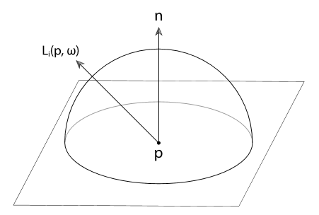
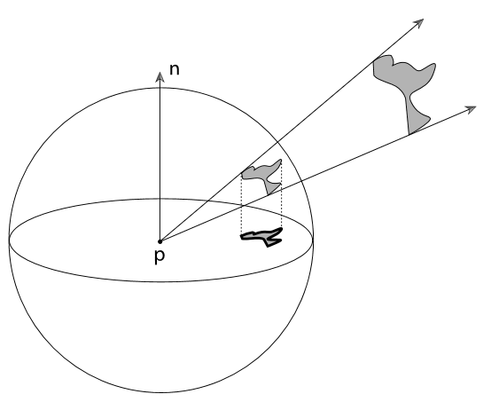
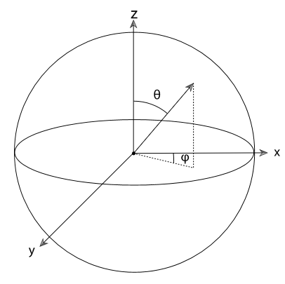
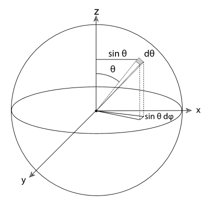
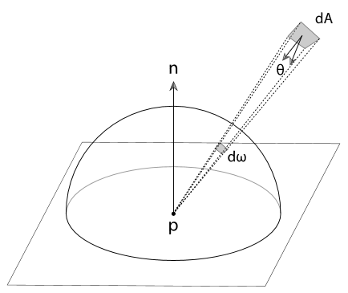
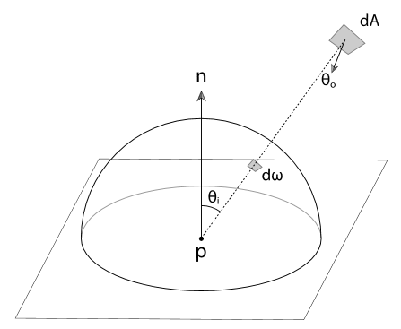

# 与辐射度积分协同工作

渲染过程中最频繁的任务就是计算上一节介绍的物理量的积分, 这里我们会展示一些使这种计算更容易的技巧. 下面我们会以计算某一点的入射辐射度( irradiance )为例讲解这些技巧. 在方向集合 $\Omega$ 内, 法线为 $\vec{n}$ 的表面上的一点 p 出的入射辐射度为:

$$
E(p, \vec{n}) = \int_{\Omega}L_i(p, \omega)|\cos\theta|d\omega
$$

这里的 $L_i(p, \omega)$ 是入射辐射度函数, 而 $\cos\theta$ 项则来源于辐射度定义中的 $dA^\perp$. $\theta$ 表示 $\omega$ 与表面法线 $\vec{n}$ 的夹角. 入射辐射度则一般在给定法线 $\vec{n}$ 上的半球 $H^2(\vec{n})$ 中计算.

---

## 1. 在投影立体角上积分

积分中的余弦量经常会分散积分中表达的内容, 我们可以使用投影立体角代替立体角来解决这个问题. 投影立体角就是在立体角的基础上, 再将其投影到与表面法线垂直的圆盘上.

投影立体角 $d\omega^{\perp} = |\cos\theta|d\omega$, 所以入射辐射度的表达式转换为:

$$
E(p, \vec{n}) = \int_{H^2(\vec{n})}L_i(p, \omega)d\omega^{\perp}
$$

---

## 2. 在球坐标系上积分

将立体角上的积分转换为球坐标系 $(\theta, \phi)$ 上的积分通常是便利的. 将方向向量 $(x, y, z)$ 与球坐标系$(\theta, \phi)$ 的转化如下:

$$
\begin{aligned}
x &= \sin \theta \cos \phi \\
y &= \sin \theta \sin \phi \\
z &= \cos \theta \\
\\
\theta &= \arccos z \\
\phi &= \arctan \frac{y}{x}
\end{aligned}
$$

如下图, 在球坐标系中, 一个方向集合上的微分表面积 $d\omega = \sin \theta d \theta d \phi$

所以我们可以将最初的式子进行如下转化:

$$
\begin{aligned}
E(p, \vec{n}) &= \int_{\Omega}L_i(p, \omega)|\cos\theta|d\omega \\
&= \int_0^{2\pi}\int_0^{\pi / 2}L_i(p, \theta, \phi) \cos \theta \sin \theta d \theta d \phi
\end{aligned}
$$

如果辐射度在各个方向相同, 则 $E = \pi L_i$

---

## 3. 在面积上积分

如下图, 想象有一个具有恒定传出辐射度的四边形, 那么我们得出

$$
d\omega = \frac{dA\cos \theta}{r^2}
$$

其中 $dA$ 是四边形的面积, $\theta$ 是四边形法线与指向 p 点的向量的夹角.

因此, 我们可以将最初的式子进行如下转化, 进而计算从一个四边形光源照射到 p 点的入射辐射度:

$$
E(p, \vec{n}) = \int_AL \cos \theta_i \frac{\cos \theta_odA}{r^2}
$$

如下图, 其中, L 是四边形的辐射度, $\theta_i$ 是表面法线 $\vec{n}$ 与点 $p$ 到 $p^{\prime}$ 的向量的夹角, $\theta_o$ 是 $dA$ 表面的法线与点 $p^{\prime}$ 到 $p$ 的向量的夹角.

