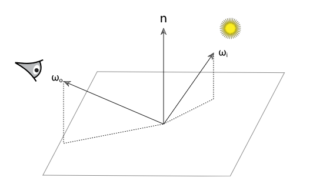

# 表面反射

当光线照射到表面的时候, 表面会散射光线, 将其中一部分光反射回环境中. 这里需要两种模型来描述这种反射: 反射光光谱的分布和方向的分布. 比如柠檬皮, 他主要吸收蓝色波长的光而反射红色和绿色波长的光, 所以当用白色光照射他时其最终呈现为黄色. 而皮肤则几乎在任何方向上都具有相同的颜色, 只在某一区域会出现一个高亮的部分. 与之相反从镜子中的点反射的光几乎完全取决于观察方向. 因为次表面反射现象的存在, 像皮肤, 树叶, 蜡等材质在反射上则更为复杂.

为了描述光的反射机制, 人们提出了两种抽象模型: BRDF 和 BSSRDF. BRDF 忽略了次表面反射现象, 这种简化对于次表面反射现象很弱的材质而言误差很小但是效率很高. BSSRDF 在 BRDF 的基础上增加了对次表面反射现象的考量.

---

## 6.1 BRDF

双向反射分布函数 BRDF( bidirectional reflectance distribution function ) 提供了一种描述表面反射的方式. 如下图所示, BRDF 描述了沿着光线的入射方向 $\omega_i$, 有多少光被表面散射到人眼的观察方向 $\omega_o$.

如果把方向 $\omega_i$ 视为微分方向锥体, 那么点 p 处的微分入射辐射度如下

$$
dE(p, \omega_i) = L_i(p, \omega_i) \cos \theta d\omega_i
$$

根据几何光学的线性假设, 反射后的微分辐射度正比于入射辐射度:

$$
dL_o(p, \omega_o) \propto dE(p, \omega_i)
$$

针对特定的 $\omega_i$ 和 $\omega_o$, 比例常数定义了表面的 BRDF:

$$
f_r(p, \omega_o, \omega_i) = \frac{dL_o(p, \omega_o)}{dE(p, \omega_i)} = \frac{dL_o(p, \omega_o)}{L_i(p, \omega_i) \cos \theta_i d\omega_i}
$$

基于物理的 BRDF 拥有两个重要的性质:

- 互易性( Reciprocity ): $f_r(p, \omega_o, \omega_i) = f_r(p, \omega_i, \omega_o)$
- 能量守恒: 对于所有的 $\omega_o$ 积分, $\int_{H^2(\vec n)}f_r(p, \omega_o, \omega^{\prime}) \cos \theta^{\prime}d\omega^{\prime} \le 1$

双向透射分布函数 BTDF( bidirectional transmittance distribution function ) 则描述了透射光线的分布状态, 我们用 $f_t(p, \omega_o, \omega_i)$ 来表示. 出于方便考虑, 我们会将 BRDF 和 BTDF 合并为一个函数, 我们称其为双向散射分布函数 BSDF( bidirectional scattering distribution function ), 表示为 $f(p, \omega_o, \omega_i)$.

BSDF 更具体的内容在第八章会介绍, 这里根据 BSDF 的定义先给出下式:

$$
dL_o(p, \omega_o) = f(p, \omega_o, \omega_i)L_i(p, \omega_i)|\cos \theta_i|d\omega_i
$$

通过对上式在入射方向的球上进行积分则可以得出出射的辐射度:

$$
L_o(p, \omega_o) = \int_{S^2}f(p, \omega_o, \omega_i)L_i(p, \omega_i)|\cos \theta_i|d\omega_i
$$

当 $S^2$ 是整个球体的时候我们称其为**散射方程**, 当 $S^2$ 为上半球时则称为**反射方程**.

---

## 2. BSSRDF

待更新...