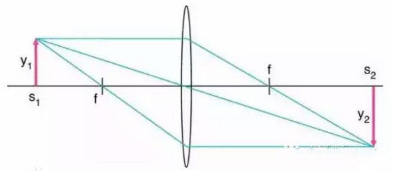
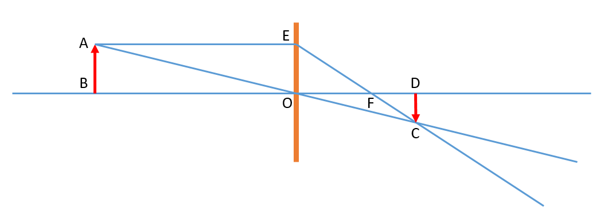
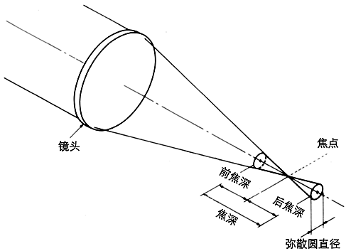
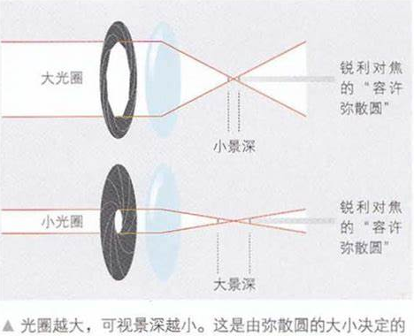
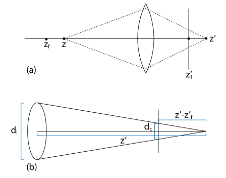
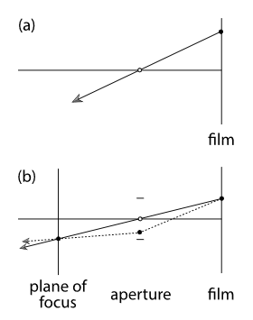

# 景深

景深 (DOF), 是指在摄影机镜头或其他成像器前沿能够取得清晰图像的成像所测定的被摄物体前后距离范围. 而光圈, 镜头及拍摄物的距离是影响景深的重要因素.

在聚焦完成后, 焦点前后的范围内所呈现的清晰图像, 这一前一后的距离范围, 便叫做景深. 在镜头前方（调焦点的前、后）有一段一定长度的空间, 当被摄物体位于这段空间内时, 其在底片上的成像恰位于焦点前后这两个弥散圆之间. 被摄体所在的这段空间的长度, 就叫景深. 换言之, 在这段空间内的被摄体, 其呈现在底片面的影象模糊度, 都在容许弥散圆的限定范围内, 这段空间的长度就是景深.

## 1. 焦点

对于简单的薄透镜模型, 当一束平行于主光轴的光通过透镜之后, 这束光会在透镜的另一侧汇聚在同一点上, 这个点就是焦点, 并且焦点也位于主光轴上.

## 2. 光线跟踪

我们已知两个基本原理:

1. 平行与主光轴的光线通过透镜, 折射光线会通过交点.
2. 通过透镜中心的光线经过透镜后传输方向不变.

利用这两个原理我们可以分析一个物体经过透镜之后的成像情况, 如下图所示.

## 3. 高斯透镜方程

先谈谈焦距的概念. 在书籍中出现了两个非常相似的名词: focal length 和 focal distance.

其中 focal length 是薄透镜的固有属性, 其表示焦点到透镜中心的距离. 而 focal distance 则更接近与摄影领域的概念, 其表示清晰成像的平面到透镜的距离. 在后文中应注意区分.

在 pbrt 的相机系统中, 我们把透镜放在 $z=0$ 的平面上, 其中心位于原点, 物体处于 $-z$ 轴所在的空间内( 注意这与相机空间使用的坐标系不同, 在相机空间中, 物体处于 $+z$ 轴所在的空间内 ). 我们用变量 $z$ 表示物距, 用变量 $z^{\prime}$ 表示相距, 用变量 $f$ 表示焦距( focal length ). 图中箭头 AB 为物体, CD 为像.

观察上图, 我们可以发现两组相似三角形

$$
\triangle ABO \sim \triangle CDO \\
\triangle EOF \sim \triangle CDF
$$

根据这两组相似三角形我们可以很容易的推导出下式, 即高斯透镜方程:

$$
\frac{1}{z^{\prime}}-\frac{1}{z}=\frac{1}{f}
$$

***PS: 注意这里的 $z$ 是负值, $z^{\prime}$ 是正值.***

利用高斯透镜方程我们可以确定: 当聚焦平面位于 $z$ 处时, 能够完全清晰成像的胶片与透镜的距离( focal distance )如下:

$$
z^{\prime}=\frac{fz}{f+z}
$$

## 4. 弥散圆与景深

不在聚焦平面上的点在胶片上所成的像则不再是一个点, 而是一个圆. 这个圆我们称其为弥散圆(circle of confusion). 虽然从原理来看, 只有一个唯一的物平面可以在像平面上产生清晰的像, 但是由于弥散圆的直径在小于某个值的时候我们并不能区分这个成像圆盘与清晰的点有什么区别, 所以我们也会把这个位置的物体所形成的像视为清晰的. 这个特性正是产生有实用价值的景深的关键.

我们把不能辨认的这个弥散圆称为容许弥散圆, 这个属性与相机画幅相关, 各个厂商也可能有所不同. 他也决定了景深的范围.

会影响弥散圆大小的因素有: 光圈大小( aperture ), 镜头焦距( focal distance ), 物体与镜头的距离. 其中镜头焦距和物体与镜头的距离会对弥散圆的大小产生影响比较容易想象, 光圈大小对弥散圆的影响则如下图所示.

利用高斯透镜方程我们还可以计算弥散圆的直径, 如下图所示, 设当前透镜聚焦在 $z_f$ 处, 其对应胶片处于 $z_f^{\prime}$ 处( 即 $focal \ distance = z_f^{\prime}$ ). 以 $z$ 点为例, 其实际清晰聚焦的位置 $z^{\prime}$ 位于 $z_f^{\prime}$ 后面, 其在胶片上便投影为一个圆盘, 我们可以根据图( b )所示的相似三角形对弥散圆直径 $d_c$ 进行计算, 其中 $d_l$ 表示镜头直径.

根据三角相似定理可得:

$$
\frac{d_l}{z^{\prime}} = \frac{d_c}{|z^{\prime}-z_f^{\prime}|}
$$

整理上式并将高斯透镜方程带入可得:

$$
d_c = \Big|\frac{d_lf(z - z_f)}{z(f + z_f)}\Big|
$$

*实际应用中我们一般用 " f 值" n 来表示光圈的直径, 即 $d_l = f / n$. 也就是我们常说的 F2.4, F1.8 之类的.*

## 5. 薄透镜建模

下图( a )表示小孔成像相机的光线, 形成在胶片上的某一点只需要一条光线. 下图( b )表示有限光圈的相机模型. 形成其胶片上的一个点需要在镜头上采样多条光线, 但是我们知道焦平面上的某一点发射的所有光线都将汇聚在胶片上的同一点上, 所以, 可以据此构建我们需要的这些光线.

PS: 书中的计算公式 $t=focalDistance/d_z$ 里的 focalDistance 根据函数语义表示的应该是聚焦平面到镜片的距离, 而不是上文中表示的胶片到镜片的距离... 这一节里的名词使用好迷(= =|)