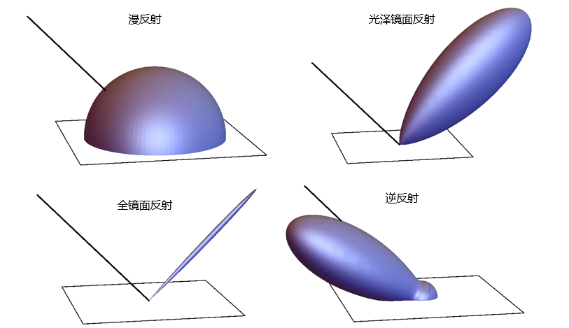
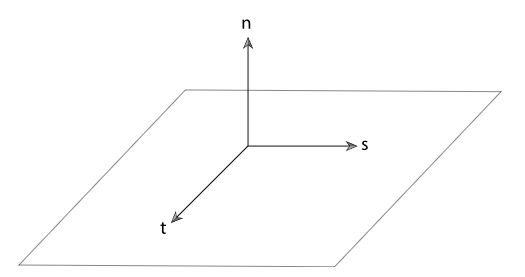
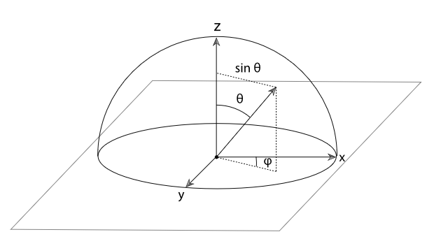

# 概述

## 1. 反射模型接口与系统整体的适配

当使用 SamplerIntegrator 时, 每一条光线都会调用 SamplerIntegrator::Li() 方法. 此方法首先寻找射线与图元最近的交点, 然后调用图元的表面着色器. 表面着色器定义为 Material 子类中的方法, 并负责决定在表面特定点上的 BSDF. 他返回一个包含 BRDF 和 BTDF 的 BSDF 对象, 并且已经完成内存分配以及初始化用以表示交点处的散射状态. 最后积分器基于交点处的入射光照, 利用着色器返回的 BSDF 对象来计算交点处的散射光线.

回顾第一章, 当时将 SamplerIntegrator::Li() 的流程整理如下图所示

---

## 2. 基本术语

主要是区分四种基本的反射类型: 漫反射( diffuse ), 光泽镜面反射( glossy specular ), 全镜面反射( perfect specular ), 逆反射( retro-reflective ). 四种反射模型如下图所示, 效果很清晰就不赘述了.

在给定反射类型之后, 反射分布函数可能呈现各向同性( isotropic )或者各向异性( anisotropic )状态. 大多数物体都是呈现各向同性的, 当视角改变时反射分布不会变化. 但是仍然存在表面反射呈现各向异性的物体, 诸如拉丝金属, 光盘, 头发等.

---

## 3. 几何设置

pbrt 的反射计算在专门的反射坐标系中进行, 其中着色点处的两个切线和法线分别于 x, y 和 z 轴对齐. 所有传递给 BRDF 和 BTDF 的方向向量及其返回的方向向量都定义在这个坐标下. 在反射坐标系中, 我们通过球坐标的形式 $(\theta, \phi)$ 来表示方向向量 $\omega$. 角度 $\theta$ 为方向与 z 轴的夹角, 角度 $\phi$ 则为方向投影到 xy 平面之后与 x 轴的夹角.

基于这样的定义, 我们可以方便的计算出某些量值. 例如:

$$
\cos\theta = (n\centerdot\omega) = ((0,0,1)\centerdot\omega) = \omega_z
$$

阅读本章涉及的代码以及添加 BRDF 和 BTDF 到 pbrt 系统时需要注意下面这些内容

1. 入射方向 $\omega_i$ 和出射方向 $\omega_o$ 都应该标准化之后的向量, 并且转换到表面的局部坐标系时都是向外的.
2. 表面法线通常指向外侧, 这可以方便的判断光线是射向表面还是驶离表面. 另外 pbrt 并未翻转法线, 也就是说 $\omega_i$ 和 $\omega_o$ 都有可能与法线处在表面的相反方向上.
3. 用于着色的局部坐标系和 Shape::Intersect() 使用的坐标系不一定完全相同, 二者可在相交计算和着色操作之间进行调整, 以实现诸如凹凸贴图等效果.
4. BRDF 和 BTDF 本身的实现不需要关心 $\omega_i$ 和 $\omega_o$ 是否位于同一个半球内, 更高层的代码会保证只有反射例程或透射例程被恰当的执行. 这部分内容会在 9.1 材质部分解释.